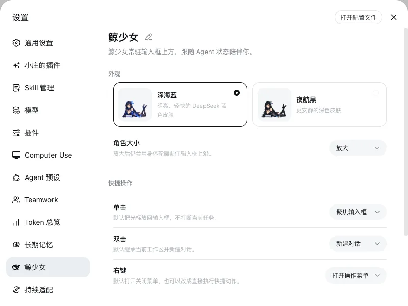

# dsh-whale-girl

English | [中文](README.md)

  

Add a native cross-page companion whose presence, shortcuts, and feedback follow the current DSH session state. Its left circular control points toward the opposite side and switches the companion to roughly 10% or 90% of the composer width with the existing bubble dissolve-and-appear transition. The companion now also follows the composer immediately on the first switch from the centered new-conversation page to an existing conversation.

Current master ships complete native plugin folders and preserves each Settings entry's original plugin-owned icon. Remove its folder to uninstall the capability. See [INSTALL.md](INSTALL.md) for shared compatibility patches and installation checks.

## Install

1. Choose **Code → Download ZIP** for current master; older Releases do not include this repair.
2. Give the ZIP to an AI that can read and modify the target DSH project.
3. Tell the AI: **Read AGENTS.md, INSTALL.md, and manifest.json first. Install only this plugin and preserve existing plugins, data, conversations, attachments, and settings.**
4. The installing AI merges the code and Cordis rows into the target version and validates only the entry points directly owned by this plugin.

## Contents

- <code>payload/</code>: plugin code and required runtime assets copied from the main repository.
- <code>manifest.json</code>: composition rows, sources, main-repository commit, and per-file SHA-256.
- <code>INSTALL.md</code>: direct installation, conflict adaptation, failure recovery, and narrow verification.
- <code>docs/</code>: real product screenshots from this version.

## Source and license

This repository is a one-way distribution mirror of [Xiaozhuang DSH](https://github.com/niushuanan/xiaozhuang-dsh), not an independent development source. Its contents are synchronized from main-repository commit [`e745482d8f`](https://github.com/niushuanan/xiaozhuang-dsh/commit/e745482d8f5e33497d9ed46a2a88681456024334); the latest released installation bundle remains [`xiaozhuang-v0.4.2`](https://github.com/niushuanan/dsh-whale-girl/releases/tag/xiaozhuang-v0.4.2). Licensed under the [MIT License](LICENSE).
